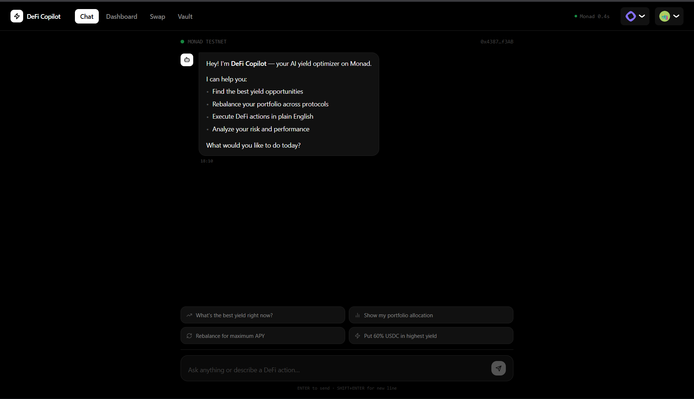
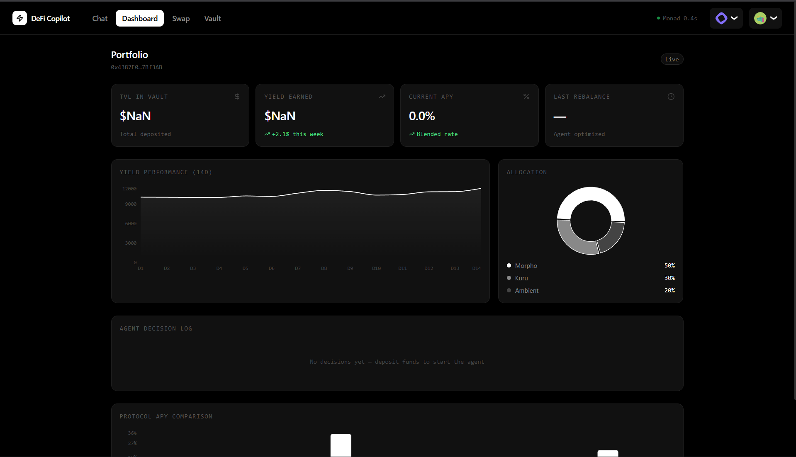
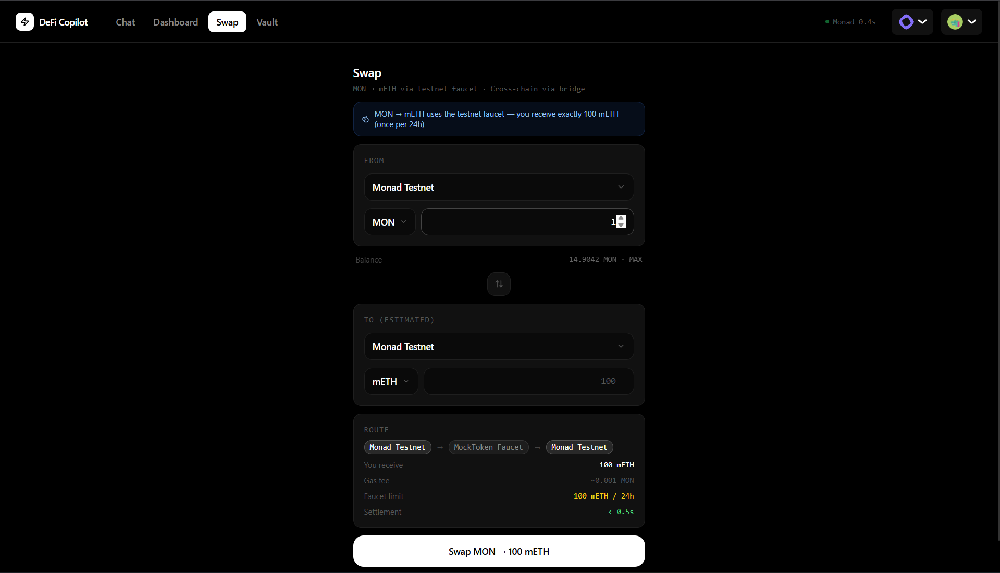
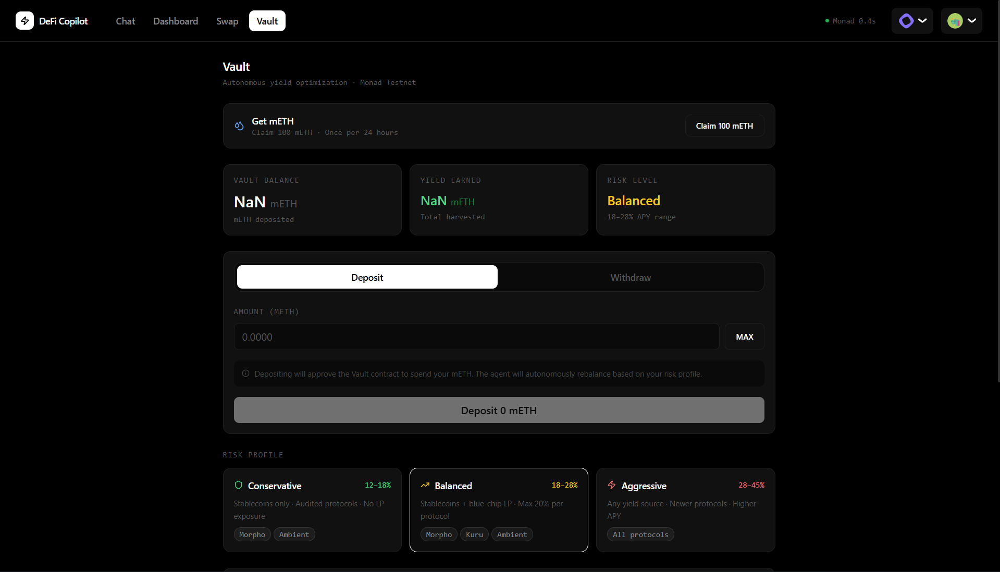

<div align="center">

# ⚡ DeFi Copilot

**AI-Powered Autonomous Yield Optimizer & Natural Language DeFi Agent**

Built on Monad — 0.4s blocks · 10,000 TPS · Fully on-chain decision log

[](https://testnet.monadexplorer.com)
[](https://nextjs.org)
[](https://wagmi.sh)
[](https://openai.com)
[](https://soliditylang.org)

</div>

---

## Screenshots

<table>
  <tr>
    <td align="center"><b>AI Chat</b></td>
    <td align="center"><b>Portfolio Dashboard</b></td>
  </tr>
  <tr>
    <td></td>
    <td></td>
  </tr>
  <tr>
    <td align="center"><b>Token Swap</b></td>
    <td align="center"><b>Vault & Yield</b></td>
  </tr>
  <tr>
    <td></td>
    <td></td>
  </tr>
</table>

---

## What Is This?

DeFi Copilot is a full-stack autonomous DeFi application that lets you:

- **Talk to your portfolio** — ask "what's my APY?" or "move me to conservative" in plain English
- **Swap tokens with live rates** — MON ↔ mETH with a real-time price ticker that updates every 3 seconds
- **Deposit into an AI-managed vault** — the agent monitors yield sources every ~10 blocks and rebalances autonomously
- **Read every decision on-chain** — every LLM reasoning step is stored immutably in the `DecisionLog` contract

---

## Architecture

```
┌─────────────────────────────────────────────────────────────┐
│                        USER BROWSER                         │
│  ┌──────────┐  ┌───────────┐  ┌──────────┐  ┌──────────┐  │
│  │ AI Chat  │  │ Dashboard │  │   Swap   │  │  Vault   │  │
│  └────┬─────┘  └─────┬─────┘  └────┬─────┘  └────┬─────┘  │
│       └──────────────┴──────────────┴──────────────┘        │
│                   Next.js 14 + wagmi v2                      │
└───────────────────────────┬─────────────────────────────────┘
                            │  RPC / tx
                            ▼
┌─────────────────────────────────────────────────────────────┐
│                    MONAD TESTNET (10143)                     │
│   ┌──────────────┐  ┌───────────────┐  ┌────────────────┐  │
│   │  Vault.sol   │  │ DecisionLog   │  │ AgentRegistry  │  │
│   │  (deposits,  │  │  (on-chain    │  │  (auth layer)  │  │
│   │  rebalance)  │  │   reasoning)  │  │                │  │
│   └──────────────┘  └───────────────┘  └────────────────┘  │
│   ┌──────────────┐                                          │
│   │ MockToken    │ ← mETH (18 decimals, faucet + mint)      │
│   └──────────────┘                                          │
└───────────────────────────┬─────────────────────────────────┘
                            │  poll every ~10 blocks
                            ▼
┌─────────────────────────────────────────────────────────────┐
│                      AGENT (Node.js)                        │
│   rateFetcher → llmAgent (GPT-4o-mini) → txExecutor         │
│   Reads APY data · Decides allocation · Signs rebalance tx  │
└─────────────────────────────────────────────────────────────┘
```

---

## Features

| Feature | Details |
|---------|---------|
| **AI Chat** | GPT-4o powered NL interface — ask portfolio questions, trigger actions |
| **Live Swap** | MON ↔ mETH with ±1.2% simulated rate walk updated every 3s |
| **Vault** | Deposit mETH, pick risk profile (Conservative / Balanced / Aggressive) |
| **Auto-Rebalance** | Agent polls Monad every ~10 blocks, LLM decides optimal allocation |
| **Decision Log** | Every agent action + reasoning stored on-chain in `DecisionLog.sol` |
| **Portfolio Dashboard** | Live balance, yield earned, allocation breakdown, decision history |
| **mETH Faucet** | Claim 100 mETH once per 24h directly from the UI |
| **Multi-chain Swap UI** | Supports Monad, Sepolia, Base, Arbitrum, Optimism testnets |

---

## Project Structure

```
Ai-nomad/
├── contracts/               ← Solidity contracts (deployed via Remix)
│   ├── Vault.sol            ← Core vault: deposit, withdraw, rebalance
│   ├── DecisionLog.sol      ← Immutable on-chain agent reasoning log
│   ├── AgentRegistry.sol    ← Agent authorization registry
│   └── MockToken.sol        ← mETH ERC-20 with faucet + mint
├── frontend/                ← Next.js 14 App
│   └── src/
│       ├── app/
│       │   ├── page.tsx     ← Main layout with tab navigation
│       │   └── api/chat/    ← GPT-4o chat API route
│       ├── components/
│       │   ├── SwapPanel.tsx        ← Live rate swap UI
│       │   ├── VaultPanel.tsx       ← Vault deposit/withdraw/risk
│       │   ├── PortfolioDashboard.tsx
│       │   └── AIChatPanel.tsx
│       ├── hooks/
│       │   ├── useVault.ts          ← Deposit, withdraw, faucet, risk
│       │   └── usePortfolio.ts      ← Portfolio + decision history
│       └── lib/
│           ├── contracts.ts         ← ABIs + deployed addresses
│           └── wagmi-config.ts      ← Chain config + wallet connectors
├── agent/                   ← Autonomous rebalancing bot
│   └── src/
│       ├── index.ts         ← Main polling loop (~10 block interval)
│       ├── rateFetcher.ts   ← Reads APY from yield sources
│       ├── llmAgent.ts      ← GPT-4o-mini allocation decisions
│       ├── txExecutor.ts    ← Signs + sends rebalance transactions
│       └── nlParser.ts      ← Natural language command parser
├── public/                  ← App screenshots
│   ├── ai-chat.png
│   ├── dashbaord.png
│   ├── swap.png
│   └── vault.png
└── .env                     ← All environment variables (root)
```

---

## Quick Start

### 1. Environment Variables

Create/fill `.env` in the project root:

```bash
# ── Wallet ────────────────────────────────────────────────
AGENT_PRIVATE_KEY=0x...          # Agent wallet private key

# ── WalletConnect ─────────────────────────────────────────
NEXT_PUBLIC_WALLETCONNECT_PROJECT_ID=your_project_id

# ── Deployed Contracts (Monad Testnet) ────────────────────
NEXT_PUBLIC_METH_ADDRESS=0x36412Aef56F1693Bb87dBf981CcFEbdeb2FFFe36
NEXT_PUBLIC_VAULT_ADDRESS=0x4098B776F92bEb21D48150cf4AF9e29937f5B33f
NEXT_PUBLIC_DECISION_LOG_ADDRESS=0x9583F66a7D93522093626f6BfbA954d830cd0C9b
NEXT_PUBLIC_AGENT_REGISTRY_ADDRESS=0x947944b9a7eadB4398692bDa259b21FA9B33d956
NEXT_PUBLIC_WMON_ADDRESS=0x760AfE86e5de5fa0Ee542fc7B7B713e1c5425701

# ── AI ────────────────────────────────────────────────────
OPENAI_API_KEY=sk-proj-...
```

Also copy these `NEXT_PUBLIC_*` vars into `frontend/.env.local` (Next.js only reads `.env` from its own folder):

```bash
cp .env frontend/.env.local
```

### 2. Deploy Contracts (Remix IDE)

> Contracts are already deployed on Monad Testnet — skip this if using the addresses above.

```
1. Open remix.ethereum.org → add Monad Testnet to MetaMask
2. Deploy MockToken.sol       → copy address → NEXT_PUBLIC_METH_ADDRESS
3. Deploy DecisionLog.sol     → copy address → NEXT_PUBLIC_DECISION_LOG_ADDRESS
4. Deploy AgentRegistry.sol   → copy address → NEXT_PUBLIC_AGENT_REGISTRY_ADDRESS
5. Deploy Vault.sol(mETH, DecisionLog, AgentRegistry)
                              → copy address → NEXT_PUBLIC_VAULT_ADDRESS

Post-deploy:
6. decisionLog.authorizeCaller(vaultAddress)
7. agentRegistry.registerAgent(agentWallet, "DeFi Copilot v1", "Yield optimizer")
8. mockToken.transferOwnership(agentWallet)   ← allows agent to call mint()
```

### 3. Run Frontend

```bash
cd frontend
npm install
npm run dev
# → http://localhost:3000
```

### 4. Run Agent

```bash
cd agent
npm install
npm run dev
# Polls Monad every ~10 blocks, auto-rebalances vault allocations
```

---

## Deployed Contracts (Monad Testnet)

| Contract | Address |
|----------|---------|
| MockToken (mETH) | [`0x36412Aef56F1693Bb87dBf981CcFEbdeb2FFFe36`](https://testnet.monadexplorer.com/address/0x36412Aef56F1693Bb87dBf981CcFEbdeb2FFFe36) |
| Vault | [`0x4098B776F92bEb21D48150cf4AF9e29937f5B33f`](https://testnet.monadexplorer.com/address/0x4098B776F92bEb21D48150cf4AF9e29937f5B33f) |
| DecisionLog | [`0x9583F66a7D93522093626f6BfbA954d830cd0C9b`](https://testnet.monadexplorer.com/address/0x9583F66a7D93522093626f6BfbA954d830cd0C9b) |
| AgentRegistry | [`0x947944b9a7eadB4398692bDa259b21FA9B33d956`](https://testnet.monadexplorer.com/address/0x947944b9a7eadB4398692bDa259b21FA9B33d956) |

---

## Yield Sources

| Protocol | Pair | APY | Risk | TVL |
|----------|------|-----|------|-----|
| Morpho | USDC Lending | 18.4% | Low | $2.1M |
| Ambient | USDC Stable LP | 14.1% | Low | $3.4M |
| Kuru | MON/WMON | 22.5% | Medium | $1.2M |
| Kuru | MON/USDC | 32.7% | Medium | $890K |

---

## Risk Profiles

| Profile | Yield Range | Strategy |
|---------|-------------|----------|
| **Conservative** | 12–18% APY | Stablecoins only · Audited protocols · No LP |
| **Balanced** | 18–28% APY | Stablecoins + blue-chip LP · Max 20% per protocol |
| **Aggressive** | 28–45% APY | Any yield source · Newer protocols |

---

## Tech Stack

| Layer | Technology |
|-------|-----------|
| Blockchain | Monad Testnet — Chain ID 10143, ~0.4s blocks, 10k TPS |
| Smart Contracts | Solidity 0.8.20 + OpenZeppelin v5 |
| Frontend | Next.js 14 (App Router), TypeScript, Tailwind CSS |
| Web3 | wagmi v2, viem, RainbowKit v2 |
| AI Chat | OpenAI GPT-4o via Next.js API route |
| Agent Brain | OpenAI GPT-4o-mini for allocation decisions |
| Swap | Live rate engine — 1 MON ≈ 1800 mETH, ±1.2% random walk |

---

## Monad Testnet

| Parameter | Value |
|-----------|-------|
| Chain ID | 10143 |
| RPC URL | `https://testnet-rpc.monad.xyz` |
| Explorer | https://testnet.monadexplorer.com |
| Faucet | https://faucet.monad.xyz |
| Native Token | MON |

---

## Security

- Agents can **rebalance only** — they cannot withdraw user funds
- Reentrancy protection on all state-changing vault functions
- Role-based agent authorization via `AgentRegistry`
- All decisions logged immutably on-chain with LLM reasoning
- mETH `mint()` restricted to contract owner (agent wallet)

---

<div align="center">
  Built for <b>Monad Hackathon</b> · Powered by GPT-4o + Monad's parallel EVM
</div>
